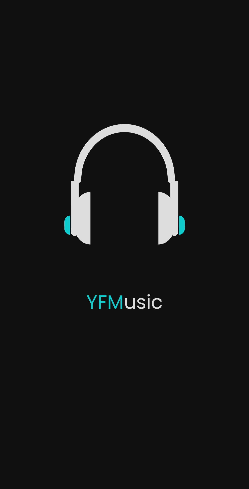

<p align="center"> 
  
</p>

<h1 align="center"> YFMusic </h1>

<p align="center">
  <a href="https://github.com/ErickLuizA/yfmusic/graphs/commit-activity" alt="Maintenance">
    
  </a>

  <a href="./LICENSE" alt="License: MIT">
    
  </a>

<br/>


<a href="https://github.com/ErickLuizA/yfmusic/stargazers">
  
</a>

<p align="center">
  <a href="#clipboard-description">Description</a>&nbsp;&nbsp;&nbsp;|&nbsp;&nbsp;&nbsp;
  <a href="#building_construction-technologies">Technologies</a>&nbsp;&nbsp;&nbsp;|&nbsp;&nbsp;&nbsp;
  <a href="#rocket-getting-started">Getting Started</a>&nbsp;&nbsp;&nbsp;|&nbsp;&nbsp;&nbsp;
  <a href="#memo-license">License</a>
</p>

> Under construction

## :clipboard: Description

YFMusic is a music app built with React Native

## :building_construction: Technologies

- [React Native](https://reactnative.dev/)

## :rocket: Getting Started

## 1. Download the repository

```shell
 $ git clone https://github.com/ErickLuizA/yfmusic.git
```

## 2. Installation

```shell
# Go into the folder
$ cd yfmusic

# Install dependencies
$ yarn install
```

## 3. Execution

```shell
# Install app
$ yarn android or yarn ios

# Start metro bundler
$ yarn start
```

## :memo: License

This project is under the MIT license. See the file [LICENSE](LICENSE) for more details.

---

Build with 💙 By [Erick](https://www.linkedin.com/in/erick-luiz-47151a1a4/)
