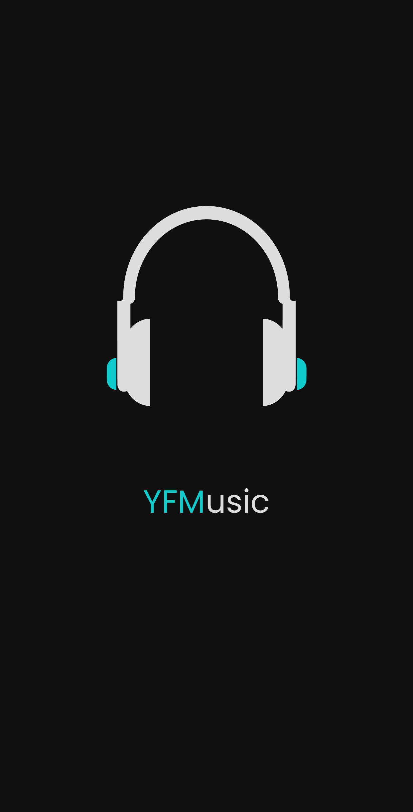

<p align="center"> 
  
</p>

<h1 align="center"> YFMusic </h1>

<p align="center">
  <a href="https://github.com/ErickLuizA/yfmusic/graphs/commit-activity" alt="Maintenance">
    
  </a>

  <a href="./LICENSE" alt="License: MIT">
    
  </a>

<br/>


<a href="https://github.com/ErickLuizA/yfmusic/stargazers">
  
</a>

<p align="center">
  <a href="#clipboard-description">Description</a>&nbsp;&nbsp;&nbsp;|&nbsp;&nbsp;&nbsp;
  <a href="#building_construction-technologies">Technologies</a>&nbsp;&nbsp;&nbsp;|&nbsp;&nbsp;&nbsp;
  <a href="#rocket-getting-started">Getting Started</a>&nbsp;&nbsp;&nbsp;|&nbsp;&nbsp;&nbsp;
  <a href="#memo-license">License</a>&nbsp;&nbsp;&nbsp;|&nbsp;&nbsp;&nbsp;
  <a href="./.github"> Screenshots</a>
</p>

> Under construction

## :clipboard: Description

YFMusic is a music app built with React Native and Node.js

## :building_construction: Technologies

- [Node.js](https://nodejs.org/en/)

  - [Typescript](https://www.typescriptlang.org/)
  - [Express](https://expressjs.com)
  - [Knex](http://knexjs.org)
  - [Pg](https://node-postgres.com)
  - [Cors](https://www.npmjs.com/package/cors)
  - [Jsonwebtoken](https://jwt.io/)
  - [ytdl-core](https://github.com/fent/node-ytdl-core)

- [React Native](https://reactnative.dev/)

  - [Expo](https://expo.io)
  - [React Navigation](https://reactnavigation.org/)
  - [AsyncStorage](https://github.com/react-native-community/async-storage)
  - [Checkbox](https://github.com/react-native-community/react-native-checkbox)
  - [Expo-av](https://docs.expo.io/versions/latest/sdk/av/)
  - [Axios](https://github.com/axios/axios)

## :rocket: Getting Started

## 1. Download the repository

```shell
 $ git clone https://github.com/ErickLuizA/yfmusic.git
```

## 2. Installation

```shell
# Go into the repository
$ cd yfmusic
```

### Server

```shell
# Go to the server folder
$ cd server

# Install dependencies
$ yarn install
```

### Mobile

```shell
# Go to the mobile folder
$ cd mobile

# Install dependencies
$ yarn install
```

## 3. Execution

### Server

```shell
# On the server folder
$ yarn dev
```

### Mobile

```shell
# On the mobile folder
$ yarn start
```

## :memo: License

This project is under the MIT license. See the file [LICENSE](LICENSE) for more details.

---

Build with 💙 By [Erick](https://www.linkedin.com/in/erick-luiz-47151a1a4/)
