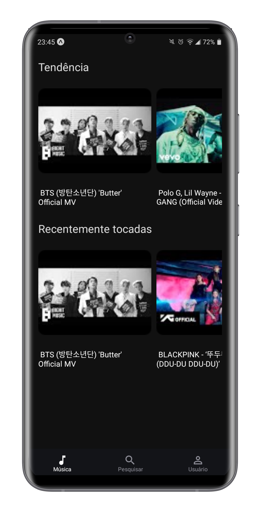
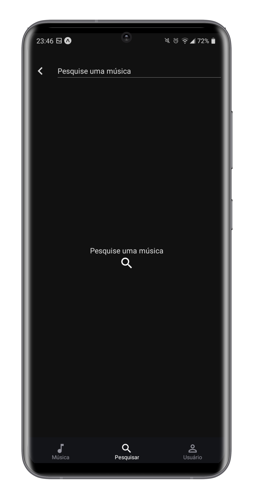
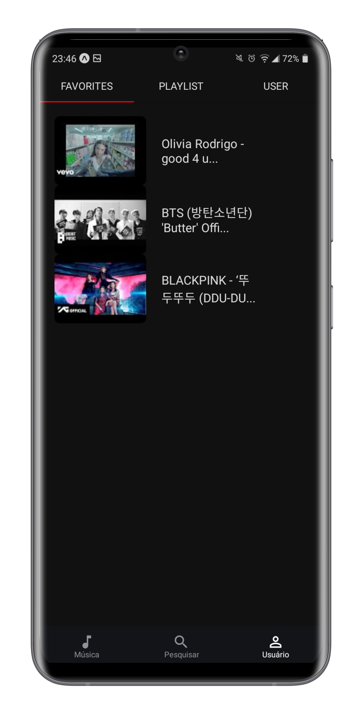
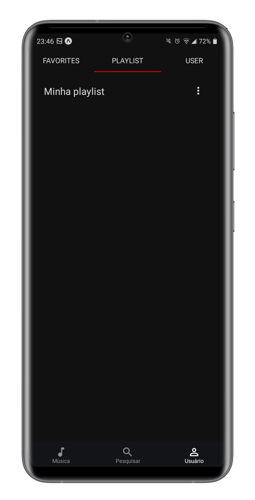
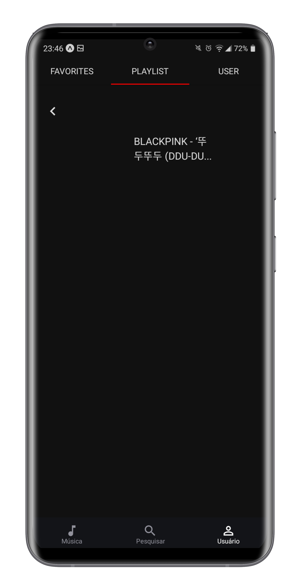
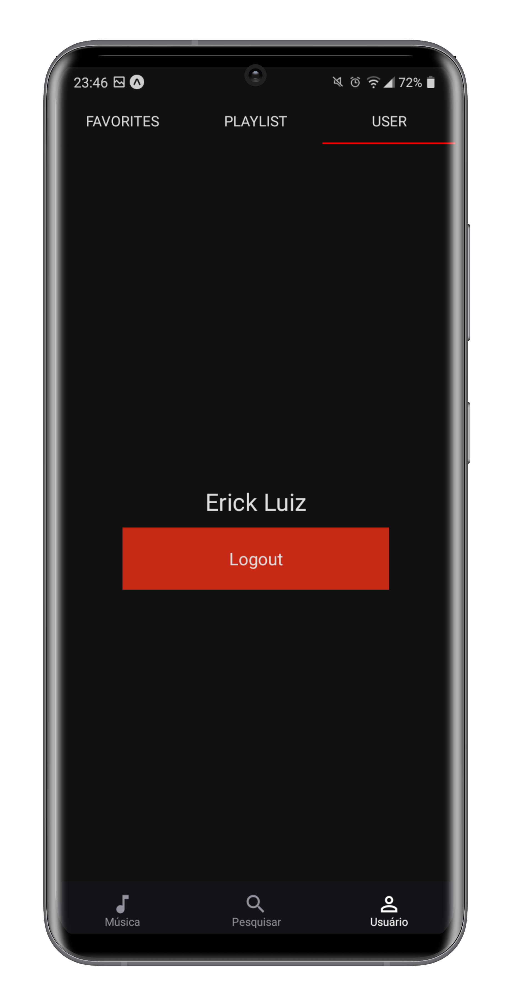
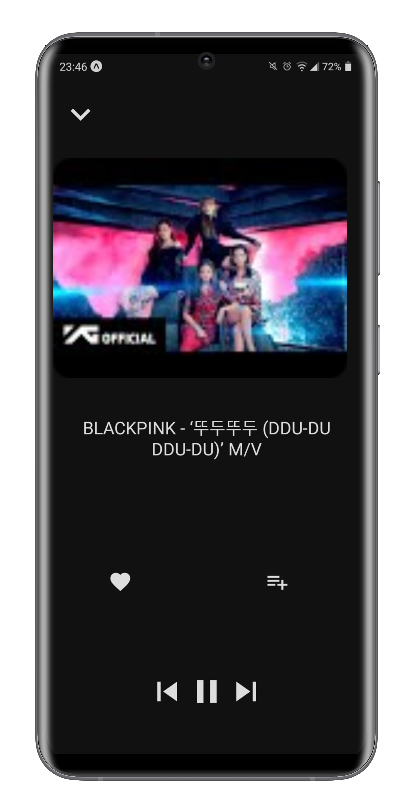
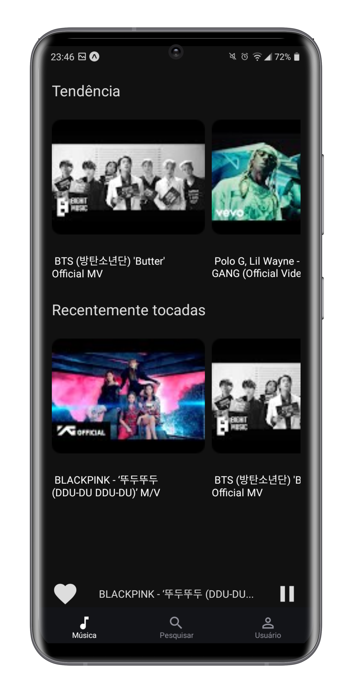

<p align="center"> 
  
</p>

<h1 align="center"> rn-music-app </h1>

<p align="center">
  <a href="https://github.com/ErickLuizA/rn-music-app/graphs/commit-activity" alt="Maintenance">
    
  </a>

  <a href="./LICENSE" alt="License: MIT">
    
  </a>

<br/>


<a href="https://github.com/ErickLuizA/rn-music-app/stargazers">
  
</a>

<p align="center">
  <a href="#clipboard-description">Description</a>&nbsp;&nbsp;&nbsp;|&nbsp;&nbsp;&nbsp;
  <a href="#building_construction-technologies">Technologies</a>&nbsp;&nbsp;&nbsp;|&nbsp;&nbsp;&nbsp;
  <a href="#rocket-getting-started">Getting Started</a>&nbsp;&nbsp;&nbsp;|&nbsp;&nbsp;&nbsp;
  <a href="#memo-license">License</a>&nbsp;&nbsp;&nbsp;|&nbsp;&nbsp;&nbsp;
  <a href="#framed_picture-screenshots">Screenshots</a>
</p>

## :clipboard: Description

rn-music-app is a music app built with React Native

## :building_construction: Technologies

- [@react-native-async-storage/async-storage](https://www.npmjs.com/package/@react-native-async-storage/async-storage)
- [@react-navigation/bottom-tabs](https://www.npmjs.com/package/@react-navigation/bottom-tabs)
- [@react-navigation/material-top-tabs](https://www.npmjs.com/package/@react-navigation/material-top-tabs)
- [@react-navigation/native](https://www.npmjs.com/package/@react-navigation/native)
- [@react-navigation/stack](https://www.npmjs.com/package/@react-navigation/stack)
- [axios](https://www.npmjs.com/package/axios)
- [babel-plugin-inline-dotenv](https://www.npmjs.com/package/babel-plugin-inline-dotenv)
- [expo](https://www.npmjs.com/package/expo)
- [expo-av](https://www.npmjs.com/package/expo-av)
- [expo-status-bar](https://www.npmjs.com/package/expo-status-bar)
- [react](https://www.npmjs.com/package/react)
- [react-native](https://www.npmjs.com/package/react-native)
- [react-native-gesture-handler](https://www.npmjs.com/package/react-native-gesture-handler)
- [react-native-reanimated](https://www.npmjs.com/package/react-native-reanimated)
- [react-native-safe-area-context](https://www.npmjs.com/package/react-native-safe-area-context)
- [react-native-vector-icons](https://www.npmjs.com/package/react-native-vector-icons)

## :rocket: Getting Started

## 1. Download the repository

```shell
 $ git clone https://github.com/ErickLuizA/rn-music-app.git
```

## 2. Installation

```shell
# Go into the folder
$ cd rn-music-app

# Install dependencies
$ npm install
```

## 3. Execution

```shell
# Run the app on expo
$ npm start
```

## :framed_picture: Screenshots

<div>
  
  
  
  
  
  
  
  

</div>

[API](https://github.com/ErickLuizA/rn-music-app-api)

## :information_source: TODO

- Implement tests
- Play playlist
- Offline mode

#### :warning: <div>Icons made by <a href="https://www.flaticon.com/authors/freepik" title="Freepik">Freepik</a> from <a href="https://www.flaticon.com/" title="Flaticon">www.flaticon.com</a></div>

## :memo: License

This project is under the MIT license. See the file [LICENSE](LICENSE) for more details.

---

Build with 💙 By [Erick](https://www.linkedin.com/in/erick-luiz-47151a1a4/)
